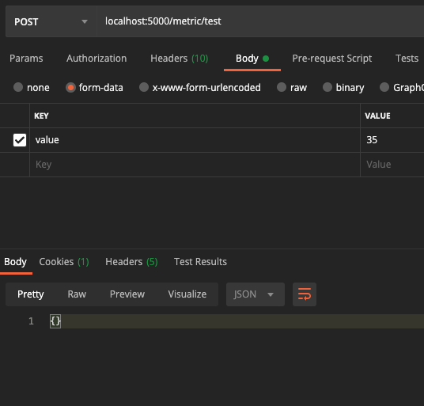
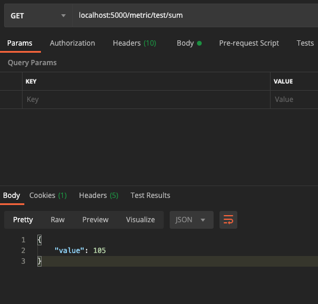

This service uses much of the official Flask tutorial scaffolding code

Metric file is in flaskr/log.py

To run locally:
1. Run run.sh to run flask locally
2. Make sure you initialize the db by activating environment and export env variables and run flask init-db

Test
1. pip install '.[test]'
2. pytest

Run with coverage report:
1. coverage run -m pytest
2. coverage report
3. coverage html  # open htmlcov/index.html in a browser